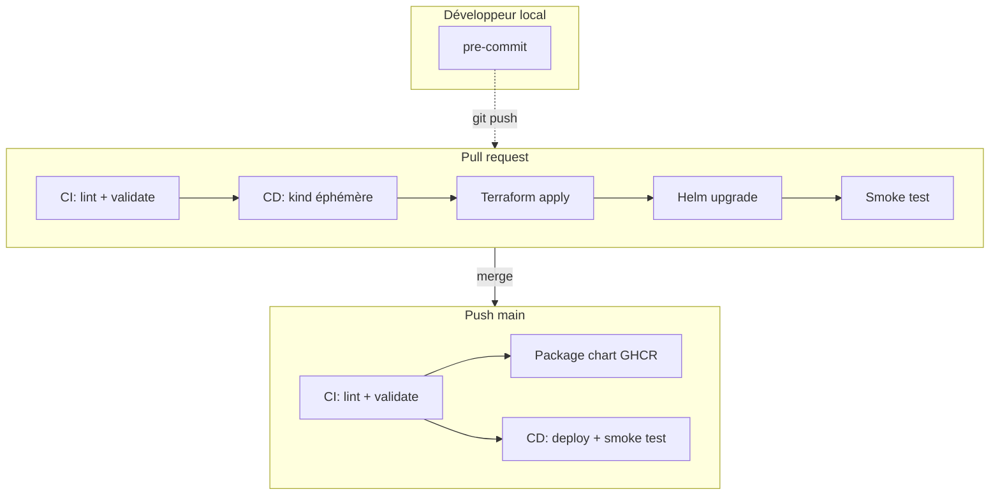
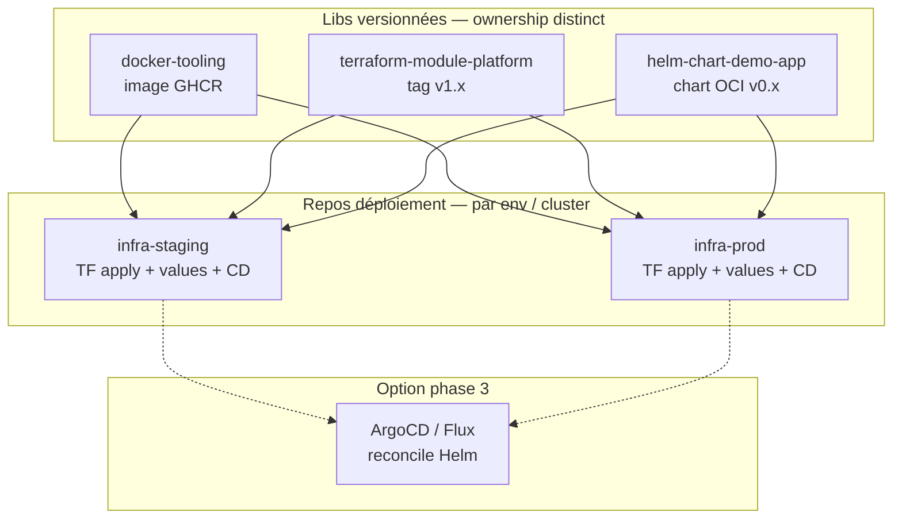

# infra-golden-path

Petit repo d'infra pour provisionner un namespace Kubernetes et déployer une app nginx via Helm — le tout avec [kind](https://kind.sigs.k8s.io/) en CI/CD, sans compte cloud.

L'idée : modéliser un flux Platform classique (IaC → delivery → contrôles qualité) sur un périmètre volontairement réduit. **Le déploiement se fait uniquement en CI/CD** ; en local, seuls les hooks pre-commit sont attendus.

## Table des matières

- [Contexte](#contexte)
- [Architecture](#architecture)
- [Prérequis (local)](#prérequis-local)
- [Démarrage rapide](#démarrage-rapide)
- [Flux CI/CD](#flux-cicd)
- [Structure du repo](#structure-du-repo)
- [Debug local (optionnel)](#debug-local-optionnel)
- [Gouvernance](#gouvernance)
- [Choix de conception](#choix-de-conception)
- [Évolution : phase 1 → phase 2](#évolution--phase-1-mono-repo--phase-2-multi-repo)
- [Extension cloud](#extension-cloud)
- [Commandes utiles](#commandes-utiles)
- [Améliorations possibles](#améliorations-possibles)
- [Licence](#licence)

## Contexte

Cas d'usage visé :

> Provisionner un namespace + service account avec des labels standards, puis déployer une application de démo via Helm, avec une CI/CD et quelques règles d'équipe.

| Couche | Rôle |
|--------|------|
| **Terraform** | Module `platform` : namespace, ServiceAccount, labels |
| **Helm** | Chart `demo-app` : Deployment + Service, values `staging` |
| **CI** | `pre-commit` + kubeconform + package chart |
| **CD** | kind éphémère + `terraform apply` + `helm upgrade` + smoke test |
| **Gouvernance** | CODEOWNERS, Renovate, conventional commits, pre-commit |

## Architecture



## Prérequis (local)

- [Git](https://git-scm.com/)
- [pre-commit](https://pre-commit.com/#install) — seul outil requis pour contribuer

Optionnel (debug local uniquement) : Docker, kind, kubectl, Terraform, Helm.

## Démarrage rapide

### 1. Cloner et installer les hooks

```bash
git clone https://github.com/<you>/infra-golden-path.git
cd infra-golden-path
pre-commit install
pre-commit install --hook-type commit-msg
```

### 2. Vérifier avant de pousser

```bash
make pre-commit
```

### 3. Ouvrir une PR ou merger sur `main`

La **CI** (`.github/workflows/ci.yml`) exécute pre-commit, kubeconform et package le chart.

La **CD** (`.github/workflows/cd.yml`) se lance **uniquement si la CI réussit**, puis crée un cluster kind éphémère, applique Terraform, déploie Helm et lance un smoke test HTTP.

Aucun déploiement manuel n'est nécessaire.

### Environnement `staging`

Ce repo n'a pas de vrais environnements séparés (pas de dev/prod persistants). Le label `staging` et le namespace `demo-app-staging` sont une **convention de nommage** pour modéliser un flux Platform (labels, values Helm, namespace) sur un cluster kind **éphémère** recréé à chaque run CI/CD. En production réelle, on dupliquerait ce pattern avec de vrais environnements (`dev`, `staging`, `prod`) et des clusters persistants — voir [Extension cloud](#extension-cloud) et [Évolution multi-repo](#évolution--phase-1-mono-repo--phase-2-multi-repo).

## Flux CI/CD

### CI — validation

| Événement | Actions |
|-----------|---------|
| Pull request | pre-commit + kubeconform |
| Push `main` | idem + package chart |

### CD — déploiement

Déclenchée par `workflow_run` après succès de la CI (pas en parallèle).

| Événement | Actions |
|-----------|---------|
| CI réussie (PR ou push `main`) | kind → terraform apply → helm upgrade → smoke test |

Étapes du job CD :

1. Créer un cluster [kind](https://kind.sigs.k8s.io/) (`scripts/kind-config.yaml`)
2. `terraform apply` — namespace `demo-app-staging`, ServiceAccount `demo-app`, labels standardisés
3. `helm upgrade --install` — chart `demo-app` avec `values-staging.yaml`
4. Attendre les pods Ready + `curl http://demo-app/` depuis le cluster
5. Vérifier les labels plateforme (`environment=staging`, `managed-by=terraform`)

Le cluster kind est détruit à la fin du job — c'est un environnement éphémère de test d'intégration.

> **Image tooling** — les jobs CI/CD consomment l'image [`docker-tooling`](https://github.com/france-berteloot/docker-tooling) (`ghcr.io/france-berteloot/docker-tooling:latest`).

## Structure du repo

```
.
├── terraform/
│   ├── modules/platform/          # Namespace, SA, labels
│   └── environments/local/        # Stack kind (utilisée en CI/CD)
├── helm/charts/demo-app/          # Chart nginx, values-staging.yaml
├── scripts/
│   ├── kind-config.yaml           # Config kind partagée CI + debug local
│   └── setup-kind.sh
├── .github/workflows/
│   ├── ci.yml                     # Lint & validate
│   └── cd.yml                     # Deploy & smoke test
├── .pre-commit-config.yaml
├── CODEOWNERS
├── renovate.json
└── Makefile
```

## Debug local (optionnel)

Le déploiement canonique passe par la CI/CD. Pour reproduire le pipeline en local (dépannage uniquement) :

```bash
make setup-kind
cp terraform/environments/local/terraform.tfvars.example \
   terraform/environments/local/terraform.tfvars
make tf-init
make helm-install-staging   # tf-apply + helm (namespace créé par Terraform)
kubectl get all -n demo-app-staging
```

> Le port `8080` est réservé par kind (`extraPortMappings` → NodePort 30080). Pour tester l'app en local, utilise un `port-forward` sur un autre port :
> ```bash
> kubectl port-forward --address 127.0.0.1 svc/demo-app 18080:80 -n demo-app-staging
> curl http://127.0.0.1:18080
> ```

## Gouvernance

- **CODEOWNERS** — revue requise sur `terraform/`, `helm/`, `.github/`
- **Renovate** — mises à jour des providers Terraform et GitHub Actions
- **Labels** — appliqués côté Terraform et Helm pour rester cohérents
- **Conventional Commits** — hook local `commit-msg` ([Conventional Commits](https://www.conventionalcommits.org/)), non rejoué en CI

## Choix de conception

- **CI/CD-only** — le déploiement ne se fait pas manuellement ; kind en CI valide le pipeline bout en bout.
- **Module Terraform séparé** — le socle namespace/SA est réutilisable ; l'environnement `local` instancie le module pour kind.
- **Labels dans un `local`** — une seule définition partagée entre namespace et ServiceAccount (voir `terraform/modules/platform/main.tf`).
- **Un seul environnement nommé `staging`** — pas de dev/prod ici : le cluster kind est éphémère ; `staging` sert de label conventionnel pour le pipeline.
- **Helm values par environnement** — un fichier `values-staging.yaml` ; en cloud on ajouterait `values-dev.yaml`, `values-prod.yaml`, etc.
- **Pre-commit = source de vérité locale** — les checks locaux et CI passent par le même fichier ; la CI ajoute kubeconform, le packaging et le deploy.
- **Garde-fous légers** — pas d'ArgoCD, pas de policy engine : hors scope volontaire.
- **Terraform ≠ Helm** — le socle plateforme (namespace, SA, labels) et la livraison applicative (Deployment, Service) ont des cycles de vie et des ownerships différents ; on ne déploie pas le chart depuis Terraform.

## Évolution : phase 1 (mono-repo) → phase 2 (multi-repo)

Ce repo est volontairement un **mono-repo** pour la **phase 1** : valider le flux bout en bout (CI, CD, labels, séparation TF/Helm) avant de payer le coût de la coordination multi-repos.

En entreprise, la cible habituelle est plutôt un **découpage par responsabilité**, avec des artefacts **versionnés** et des repos de **composition** par environnement.

### Phase 1 — aujourd'hui (ce repo)

Tout vit ici pour itérer vite :

| Dossier | Rôle actuel | Cible phase 2 |
|---------|-------------|---------------|
| `terraform/modules/platform/` | Module socle K8s | → repo `terraform-module-platform` |
| `helm/charts/demo-app/` | Chart applicatif | → repo `helm-chart-demo-app` |
| [docker-tooling](https://github.com/france-berteloot/docker-tooling) | Image CI (repo externe) | ✅ extrait |
| `.github/workflows/` + values | Wiring CD staging | → repo `infra-staging` (ou équivalent) |

### Phase 2 — vision cible (bonnes pratiques platform)



**Principes :**

- **Libs vs déploiement** — les modules/charts/tooling sont des briques réutilisables ; le repo `infra-staging` ne fait qu'assembler des versions précises.
- **Versioning explicite** — `?ref=v1.2.0` pour Terraform, `--version 0.3.1` pour Helm ; Renovate bump les consommateurs.
- **Ownership** — équipe platform (module TF, tooling), équipe app ou platform (chart), équipe platform/SRE (repo infra par env).
- **Permissions** — accès au module IAM/cluster ≠ accès au chart applicatif.
- **Pas de Helm dans Terraform** — Terraform pose le socle ; Helm (ou GitOps) livre l'app.

**Ordre d'extraction recommandé** :

1. ~~`docker-tooling`~~ — fait
2. `terraform-module-platform` — module publié (registry Git ou Terraform Cloud)
3. `helm-chart-demo-app` — chart packagé sur GHCR (OCI)
4. Ce repo devient `infra-staging` — workflows CD + `values-staging.yaml` + références versionnées

**Ce qui change pour le développeur** — en phase 1 : un clone, une PR, pre-commit. En phase 2 : même habitude locale (pre-commit), mais un changement transversal peut toucher 2–3 repos coordonnés (ex. nouveau label platform → bump module + bump infra-staging).

> La section [Environnement `staging`](#environnement-staging) et [Extension cloud](#extension-cloud) restent valables : la phase 2 ajoute le découpage repos ; la phase 3 ajoute cloud persistant et éventuellement GitOps.

## Extension cloud

Le module `platform` reste agnostique. Pour brancher un environnement AWS/GCP/Azure :

1. Ajouter un dossier `terraform/environments/<cloud>/` avec le provider adapté
2. Backend Terraform distant (S3/GCS/Azure Storage) pour l'état
3. Remplacer `helm/kind-action` dans `cd.yml` par un déploiement vers EKS/GKE/AKS

Le chart Helm et les workflows CI ne changent pas — seule la cible de déploiement change.

> **Cloud** — ne pas stocker de credentials dans GitHub Secrets (clés AWS, kubeconfig, tokens JSON). Utiliser OIDC et un Workload Identity Provider pour obtenir des credentials éphémères depuis GitHub Actions.

## Commandes utiles

```bash
make help
make pre-commit
make helm-lint
make helm-template
```

## Améliorations possibles

- **Phase 2 multi-repo** — extraction `terraform-module-platform`, `helm-chart-demo-app` (`docker-tooling` déjà extrait).
- **Environnements cloud** — stacks `terraform/environments/<env>` avec clusters persistants (dev, staging, prod).
- **GitOps** — ArgoCD/Flux pour reconcilier le cluster à partir du chart packagé (phase 3).
- **Renovate cross-repos** — bump automatique des versions module/chart dans les repos infra.
- **commitlint en CI** — vérifier les Conventional Commits sur les titres de PR.

## Licence

MIT
